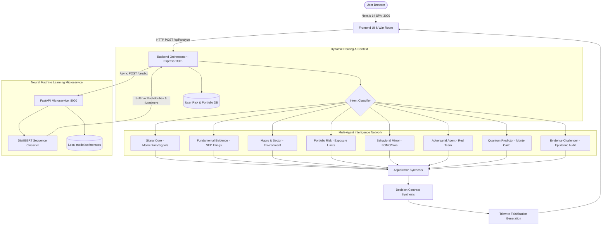

# TRIPWIRE

### The Financial Decision Firewall & Multi-Agent Intelligence System

[](https://nextjs.org/)
[](https://fastapi.tiangolo.com/)
[](https://pytorch.org/)
[](https://huggingface.co/)
[](https://github.com/huggingface/safetensors)
[](https://nodejs.org/)
[](https://www.typescriptlang.org/)
[](https://tailwindcss.com/)

> *"An AI financial intelligence system that doesn't just make a decision — it defines what would prove that decision wrong and autonomously revokes it when the evidence changes."*

---

## 📑 Table of Contents

- [The Problem](#the-problem)
- [Our Core Insight](#our-core-insight)
- [System Architecture](#system-architecture)
- [Signature Innovation: The Tripwire](#signature-innovation-the-tripwire)
- [Why Tripwire is Different](#why-tripwire-is-different)
- [Multi-Agent Intelligence Network](#multi-agent-intelligence-network)
- [Machine Learning Microservice (`ml_model`)](#machine-learning-microservice-ml_model)
  - [Model Architecture & Safetensors](#model-architecture--safetensors)
  - [REST API Specification](#rest-api-specification)
  - [Inference Pipeline & Probability Calibration](#inference-pipeline--probability-calibration)
  - [Orchestrator Integration & UI Telemetry](#orchestrator-integration--ui-telemetry)
  - [Fault Tolerance & Graceful Degradation](#fault-tolerance--graceful-degradation)
- [Personalization & Risk Context](#personalization--risk-context)
- [Decision Stress Testing Engine](#decision-stress-testing-engine)
- [Evidence Challenge & Provenance Graph](#evidence-challenge--provenance-graph)
- [Continuous Thesis Evolution](#continuous-thesis-evolution)
- [Behavioral Mirror & Cognitive Biases](#behavioral-mirror--cognitive-biases)
- [Quick Start Guide (3-Tier Setup)](#quick-start-guide-3-tier-setup)
- [Directory Structure](#directory-structure)

---

## The Problem

Retail investors don't suffer from a lack of information; they suffer from a lack of **accountability**.

When an investor forms a belief (e.g., *"This stock will grow because of new management"*), that belief rarely has:
- **Explicit Invalidation Conditions**: No pre-defined triggers that would prove the reasoning wrong.
- **An Expiration Date**: Reasoning persists long after its underlying assumptions have decayed.
- **A Mechanism for Self-Correction**: When quarterly numbers disappoint, investors move the goalposts instead of admitting the thesis is broken.

Better information alone does not produce better decisions. We needed a system that protects investors from their own obsolete reasoning.

---

## Our Core Insight

**The problem is not only how investors form beliefs. It is how those beliefs survive after the evidence changes.**

Most platforms stop at one-time static analysis. Tripwire introduces the continuous **Decision Lifecycle**:

```text
Question ➔ Evidence Graph ➔ Multi-Agent War Room ➔ Neural ML Sentiment ➔ Adversarial Challenge ➔ Personal Context ➔ Decision Contract ➔ Falsification Conditions (Tripwires) ➔ Continuous Monitoring ➔ Autonomous Self-Revocation
```

---

## System Architecture

Tripwire is architected as a decoupled, high-performance split-stack system with a dedicated neural ML inference microservice:



---

## Signature Innovation: The Tripwire

A **TRIPWIRE** is a machine-checkable falsification condition derived from evidence that will invalidate an investment thesis if triggered.

For example:
1. **THESIS**: *"Company X will maintain strong earnings growth and EV margin expansion."*
2. **EVIDENCE**: Latest 10-Q filing supports a 10% YoY growth assumption.
3. **TRIPWIRE**: `Revenue Growth < 8%` (Armed and continuously evaluated).

When a Tripwire fires:
- It does **not** send a passive alert.
- It explicitly declares: **"The evidence that supported your original reasoning has been invalidated."**
- The system autonomously **revokes** the original Decision Contract and marks it `VOID`.

```text
[ACTIVE CONTRACT] ──(Revenue Growth drops to 6.2%)──> [TRIPWIRE FIRED] ──> [CONTRACT VOIDED & SUPERSEDED]
```

---

## Why Tripwire is Different

| Feature | Generic Financial Chatbot | Tripwire / SentinelIQ |
| :--- | :--- | :--- |
| **Evidence Grounding** | Predicts & hallucinates answers | Cites specific, traceable tiers of evidence (SEC, Market, Macro) |
| **Agent Specialization** | Single generic system prompt | 10 specialized, independent agent nodes |
| **Neural NLP Verification** | Unchecked LLM output | Independent DistilBERT `safetensors` ML microservice |
| **Explicit Falsifiability** | "Yes Men" that agree with user bias | Synthesizes strict, machine-checkable Tripwires |
| **Self-Revocation** | None (static answers) | Autonomously voids past decisions when evidence breaks |
| **Personalization** | Generic boilerplate disclaimer | Tailors confidence & sizing to user's real risk profile |
| **Behavioral Mirror** | Ignores user psychology | Analyzes user trading history for FOMO & bias |
| **Stress Testing** | Limited or non-existent | Simulates counterfactual shocks to test thesis fragility |

---

## Multi-Agent Intelligence Network

Tripwire orchestrates a panel of specialized intelligence nodes to evaluate financial theses from multiple adversarial perspectives:

- 📊 **Signal Core**: Quantitative momentum, volume profile, and technical signals.
- 📑 **Fundamental Evidence**: Extracts core metrics from SEC filings (10-K, 10-Q) and earnings transcripts.
- 🌐 **Macro & Sector**: Evaluates yield curves, interest rates, inflation, and sector rotation.
- 🛡️ **Portfolio Risk**: Evaluates concentration risk, correlations, and personal portfolio limits.
- 👥 **Behavioral Mirror**: Audits user trade history for cognitive biases (e.g., FOMO, over-sizing).
- ⚔️ **Adversarial Agent (Devil's Advocate)**: Dedicated Red Team built specifically to destroy the thesis.
- 🔬 **Evidence Challenger**: Epistemic audit node evaluating source decay, missing filings, and contradictions.
- ⚡ **Quantum Predictor**: Probabilistic forecasting using high-dimensional Monte Carlo simulations.
- 🧠 **ML Sentiment Engine**: Dedicated transformer-based neural microservice providing quantitative sentiment & confidence analysis.
- ⚖️ **Adjudicator**: Synthesizes conflicting opinions to construct the final immutable Decision Contract.

---

## Machine Learning Microservice (`ml_model`)

Tripwire features a dedicated **Neural NLP Classification Microservice** running locally via Python FastAPI on port `8000`. This microservice provides an independent, quantitative "second opinion" on every financial thesis submitted to the platform.

```text
┌───────────────────────────────────────────────────────────────────────────────────┐
│                           ML MICROSERVICE ARCHITECTURE                            │
│                                                                                   │
│   User Thesis Input ──> [FastAPI /predict] ──> [AutoTokenizer (DistilBERT)]       │
│                                                          │                        │
│                                                 [PyTorch Tensor]                  │
│                                                          │                        │
│                                           [AutoModelForSequenceClassification]   │
│                                           (Weights: model.safetensors ~418MB)    │
│                                                          │                        │
│                                                   [Logits]                        │
│                                                          │                        │
│                                                  [Softmax]                        │
│                                                          │                        │
│   { Negative: 0.8%, Neutral: 2.1%, Positive: 97.1% } ──> [Response Payload]       │
└───────────────────────────────────────────────────────────────────────────────────┘
```

### Model Architecture & Safetensors

- **Base Model**: `distilbert-base-uncased` (Hugging Face Transformers).
- **Classification Head**: 3-class Sequence Classification (`0: Negative`, `1: Neutral`, `2: Positive`).
- **Weights Serialization**: Loaded directly from `ml_model/model.safetensors` using Hugging Face `safetensors` for zero-copy memory mapping and secure execution.
- **Inference Mode**: PyTorch `torch.no_grad()` inference with full truncation and padding pipelines for sub-50ms latency.

### REST API Specification

#### `POST /predict`
Executes real-time neural classification on the input text.

**Request Header**: `Content-Type: application/json`

**Request Body**:
```json
{
  "text": "I want to buy TSLA because earnings are accelerating and EV adoption is growing rapidly."
}
```

**Response Body (`200 OK`)**:
```json
{
  "label": "Positive",
  "confidence": 98.45,
  "probabilities": {
    "Negative": 0.32,
    "Neutral": 1.23,
    "Positive": 98.45
  }
}
```

#### Example Usage

```bash
# Using cURL
curl -X POST "http://localhost:8000/predict" \
     -H "Content-Type: application/json" \
     -d '{"text": "Revenue growth missed estimates by 4% and forward guidance was downgraded."}'

# Response:
# {"label":"Negative","confidence":96.82,"probabilities":{"Negative":96.82,"Neutral":2.14,"Positive":1.04}}
```

```powershell
# Using PowerShell
Invoke-RestMethod -Uri "http://localhost:8000/predict" `
  -Method Post `
  -ContentType "application/json" `
  -Body '{"text": "The company reported solid earnings and raised guidance."}'
```

### Inference Pipeline & Probability Calibration

The microservice processes raw financial thesis text through a multi-stage NLP pipeline:
1. **Tokenization**: `distilbert-base-uncased` tokenizer converts text into input IDs and attention masks.
2. **Forward Pass**: Passes tensor inputs through the 6-layer transformer encoder to extract contextual embeddings.
3. **Logits Softmax**: Converts unnormalized raw logits into a calibrated probability distribution:
   $$\sigma(z)_i = \frac{e^{z_i}}{\sum_{j=1}^{K} e^{z_j}}$$
4. **Argmax & Confidence**: Identifies the primary classification category (`Negative`, `Neutral`, `Positive`) alongside its exact percentage-based confidence score.

### Orchestrator Integration & UI Telemetry

The ML microservice is integrated across all layers of SentinelIQ:
- **Backend Binding**: The Node.js Express Orchestrator (`backend/engine/orchestrator.js`) asynchronously queries `http://localhost:8000/predict` during thesis processing.
- **Decision Contract**: The sentiment label and probability distribution are attached to the immutable Decision Contract under `contract.mlSentiment`.
- **Pipeline Animation**: The ML Sentiment Engine appears as a dedicated stage in the Intelligence Network pipeline animation on the Evaluation page.
- **Agent War Room**: Visualized as an active neural NLP agent with its own telemetry badge.
- **Probability Breakdown UI**: The evaluation screen renders live color-coded progress bars for all 3 sentiment probabilities (Negative, Neutral, Positive).

### Fault Tolerance & Graceful Degradation

If the Python ML microservice is offline or initializing:
- The Node.js orchestrator catches connection errors without failing the user's request.
- The contract defaults `mlSentiment` to `{ label: "Unknown", confidence: 0 }`.
- The multi-agent RAG pipeline continues uninterrupted, ensuring 100% platform availability.

---

## Personalization & Risk Context

The exact same market data yields materially different decisions based on the user's risk profile:

- **Arjun (Conservative - 41% Tech Exposure)**: 
  - Asking to buy high-beta tech triggers a severe **Portfolio Risk** violation.
  - Decision Confidence drops due to risk penalties.
  - System generates a blast radius warning: *"Tech exposure will increase to 45% (Limit: 30%)"*.
- **Priya (Growth - 30% Tech Exposure)**: 
  - The same thesis is approved with high conviction and full position allocation.

---

## Decision Stress Testing Engine

Tripwire tests whether decisions survive counterfactual shocks before real capital is deployed:

> *"Would this decision survive if one important assumption changed?"*

- **Simulated Scenarios**:
  - Revenue growth drops below Tripwire threshold.
  - Forward guidance is withdrawn.
  - Market liquidity dries up.
  - Technology exposure breaches risk limits.
- **Telemetry Outputs**:
  - Thesis Status: `SURVIVES` vs `THESIS BREAKS`
  - Fragility Index & Worst-case confidence drawdown
  - Survival conditions and non-breaking factors

---

## Evidence Challenge & Provenance Graph

Every decision contract is backed by a verifiable **Evidence Provenance Graph**:
- **Tier 1 (SEC Filings)**: Form 10-K, 10-Q, 8-K filings with audited financial figures.
- **Tier 2 (Market & Exchanges)**: Real-time price action, order book volume, implied volatility.
- **Tier 3 (Macro & Economic)**: Federal Reserve rate distributions, CPI data, sector rotations.
- **Tier 4 (Social & Sentiment)**: Social velocity and NLP sentiment classifications.

The **Evidence Challenger** agent continuously checks for stale filings, missing disclosures, and contradiction risks.

---

## Continuous Thesis Evolution

Tripwire maintains historical version trees (`v1` $\rightarrow$ `v2` $\rightarrow$ `v3`) for every decision:
- Detects material evidence changes, verdict shifts, and Tripwire violations over time.
- Compares new evidence against previous thesis contracts.
- Preserves full audit history rather than silently overwriting past decisions.

---

## Behavioral Mirror & Cognitive Biases

Tripwire treats the investor's own psychology as a primary risk factor:
- Audits historical trade records to detect:
  - **FOMO (Fear Of Missing Out)**: Chasing momentum after multi-day rallies.
  - **Confirmation Bias**: Ignoring contradictory evidence in filings.
  - **Over-Sizing Bias**: Taking oversized positions on high-conviction trades.
  - **Loss Aversion Bias**: Prematurely exiting winning trades.
- The **Personal Adversary** agent intervenes when a new trade matches past destructive behavioral patterns.

---

## Quick Start Guide (3-Tier Setup)

To run the complete SentinelIQ / Tripwire platform, start all three tiers:

### Prerequisites
- **Node.js**: v18.0+ and `npm`
- **Python**: v3.10+ and `pip`
- **Git**

---

### Step 1: Start the ML Microservice (Port 8000)

```bash
# Navigate to the ML microservice directory
cd ml_model

# Install Python dependencies
pip install -r requirements.txt

# Start the FastAPI server
python main.py
# Or using uvicorn directly:
# uvicorn main:app --host 0.0.0.0 --port 8000 --reload
```
*The ML Microservice will be live at `http://localhost:8000` (API docs at `http://localhost:8000/docs`).*

---

### Step 2: Start the Backend Orchestrator (Port 3001)

```bash
# Open a new terminal and navigate to the backend directory
cd backend

# Install Node dependencies
npm install

# Start the Express orchestrator
node index.js
```
*The Backend Orchestrator will be live at `http://localhost:3001`.*

---

### Step 3: Start the Next.js Frontend (Port 3000)

```bash
# Open a new terminal and navigate to the frontend directory
cd frontend

# Install frontend dependencies
npm install

# Launch the Next.js development server
npm run dev
```
*Open [http://localhost:3000](http://localhost:3000) in your browser.*

---

## Directory Structure

```text
FinanceIntelligenceSystem/
├── README.md                      # Primary project documentation
├── docs/
│   ├── ARCHITECTURE.md            # Technical system architecture & Mermaid diagrams
│   └── DEMO.md                    # Judge evaluation & demo testing guide
├── ml_model/                      # Python FastAPI ML Microservice
│   ├── main.py                    # FastAPI application & PyTorch inference endpoint
│   ├── model.safetensors          # Serialized DistilBERT model weights (~418MB)
│   └── requirements.txt           # Python dependencies (fastapi, torch, transformers, safetensors)
├── backend/                       # Node.js Express Orchestrator Engine
│   ├── index.js                   # Backend entry point (Port 3001)
│   ├── package.json               # Backend dependencies
│   └── engine/                    # Multi-agent orchestrator modules
│       ├── classifier.js          # Intent routing & keyword classifier
│       ├── context.js             # User risk profiling & portfolio context
│       ├── evidence.js            # Provenance graph & confidence mathematics
│       ├── orchestrator.js        # Multi-agent orchestration & ML integration
│       ├── devilsAdvocate.js      # Adversarial Red Team review engine
│       ├── challenge.js           # Epistemic evidence challenger
│       ├── stressTest.js          # Counterfactual decision stress testing
│       ├── tracker.js             # Thesis version evolution tracking
│       └── regret.js              # Decision ledger & point-in-time replay
└── frontend/                      # Next.js 14 Web Application
    ├── package.json               # Frontend dependencies
    └── src/
        └── app/
            ├── layout.tsx         # Root layout & theme configuration
            ├── globals.css        # Tailwind & custom CSS styling
            ├── page.tsx           # Dashboard, Decision Firewall & Agent War Room
            └── evaluate/
                └── page.tsx       # Live Intelligence Network pipeline & Decision Contract UI
```

---

## License

This project is licensed under the MIT License.
