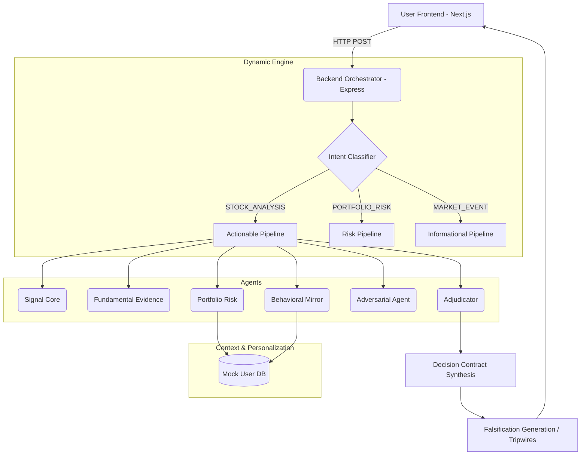

# SentinelIQ / TRIPWIRE Architecture

This document describes the implemented technical architecture for SentinelIQ.

## System Overview

The system is designed as a split full-stack application, ensuring that UI components render at 60fps via Next.js and Framer Motion, while the heavy orchestration logic runs independently on a Node.js/Express backend engine.

## 1. Intent Classifier (`backend/engine/classifier.js`)
Unlike a standard chatbot that passes the entire string to a generic prompt, SentinelIQ uses a routing engine to determine *which* specialized agents should be spun up based on keywords and patterns in the user's natural language input.

## 2. Personalization Layer (`backend/engine/context.js`)
Before agents execute, the orchestrator pulls the authenticated user's portfolio and risk metrics. This ensures that the exact same market evidence results in a personalized confidence score and blast radius warning.

## 3. The Orchestrator (`backend/engine/orchestrator.js`)
The orchestrator simulates parallel agent execution, tracks their internal status (bullish/bearish/caution), penalizes the confidence score based on disagreements and personal context, and finally compiles the **Decision Contract**.

## 4. UI/UX Layer (`frontend/src/app/page.tsx`)
The frontend is completely state-based (SPA architecture). 
- **Animation Pipeline**: A sequential stagger animation visually explains the agent orchestration process to the user while the backend computes the result.
- **Dynamic War Room**: The UI dynamically iterates through whatever agents the backend actually triggered, mapping their status to colors and rendering their dissenting opinions.
